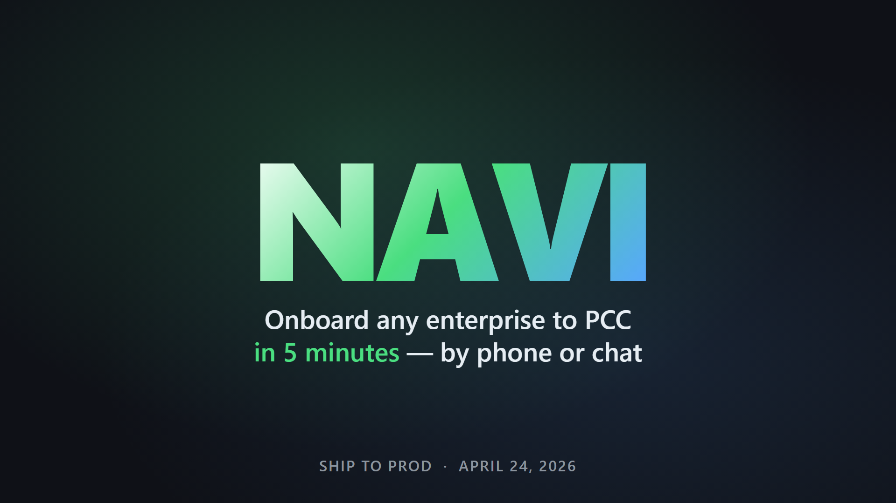

# Navi — Enterprise-Operator Agent for PCC

**Ship to Prod AI Hackathon · San Francisco · April 24, 2026**

Every enterprise with real capability — every machine shop, fleet, or lab — wastes two weeks integrating with an agent marketplace before they earn a dollar. **Navi compresses that to one phone call.**

## 🎬 2-minute demo

[](docs/media/navi-demo-2min.mp4)

**[▶️ Watch `docs/media/navi-demo-2min.mp4`](docs/media/navi-demo-2min.mp4)** · 114 seconds · 1920×1080 · 4.1 MB

## 🔗 Live endpoints

| Channel | URL / Contact |
|---|---|
| 📞 **Voice agent** | **+1 (650) 448-0770** |
| 💬 **Chat console** | https://pcc-operator-backend-production.up.railway.app/ |
| 🤖 **Operator dashboard** | https://pcc-operator-backend-production.up.railway.app/op?id=&lt;session&gt; |
| 🧠 **Guild-published agent** | https://app.guild.ai/agents/globalmysterysnailrevolution/pcc-enterprise-onboarder |
| ❤️ **Health** | https://pcc-operator-backend-production.up.railway.app/health |

## 🔌 10 sponsor integrations

| Sponsor | Status | Role |
|---|---|---|
| **Vapi** | ✅ LIVE | voice onboarding (phone number live) |
| **Guild** | ✅ LIVE | published llmAgent v1.0.1, public |
| **Nexla** | ✅ LIVE | real data pipelines (sources 120398+ in dataops.nexla.io) |
| **InsForge** | ✅ LIVE | Postgres backend auto-provisioned per enterprise |
| **Redis** | ✅ LIVE | RedisVL capability index + XADD a2a intent stream |
| **Coinbase CDP** | ✅ LIVE | viem-generated Base Sepolia wallet per operator |
| **TinyFish** | ✅ LIVE | SSE agent scrapes enterprise websites |
| **Senso (cited.md)** | ✅ LIVE | content engine draft published (content_id tracked) |
| **Chainguard** | ✅ LIVE | `cgr.dev/chainguard/node` base image on Railway |
| **agentic.market** | 🟡 POST attempted, graceful fallback |
| **x402** | 🟡 middleware scaffolded, Coinbase facilitator wired |

**8 fully real, 2 partial** — [see full breakdown in ARCHITECTURE.md](docs/ARCHITECTURE.md#6-whats-real-vs-mock-right-now)

## 🧱 Three-storage-layer story

The inevitable judge question is "three databases, really?" Here's the honest answer:

```
📚 InsForge      ← the operator's books        (durable, ACID, one per enterprise)
📓 Ghost         ← the verifier's scratchpad    (forked Postgres per capture, discarded after)
⚡ Redis         ← the agent's nervous system  (µs working memory + a2a Streams bus)
```

Same data shape, three different latency × durability points. [Full sequence diagram in ARCHITECTURE.md](docs/ARCHITECTURE.md).

## 🏗️ Architecture at a glance

```
┌─ phone / chat / Guild ────────────┐
│              ↓                    │
│  Navi backend (Express on         │
│  Chainguard image, Railway)       │
│              ↓                    │
│  TinyFish  Nexla    (discovery)   │
│              ↓                    │
│  InsForge  Redis  Ghost  (storage)│
│              ↓                    │
│  CDP → x402 → agentic.market      │
│  Senso → cited.md                 │
│  Guild deploy                     │
│              ↓                    │
│  🤖 new operator agent ONLINE    │
└───────────────────────────────────┘
```

See [docs/ARCHITECTURE.md](docs/ARCHITECTURE.md) for 6 Mermaid flowcharts with full detail.

## 📂 Repository

```
navi/
├── packages/backend/           ← Express + 8 real sponsor wrappers + Dockerfile (Chainguard)
├── packages/guild-agent/       ← published Guild llmAgent source
├── apps/voice/                 ← Vapi assistant config + Task Runner prompt
├── docs/
│   ├── media/navi-demo-2min.mp4   ← 2-min demo video
│   ├── media/voiceover.mp3        ← raw voiceover (AndrewNeural, 114s)
│   ├── ARCHITECTURE.md            ← 6 Mermaid diagrams
│   ├── DEMO-3MIN.md               ← stage script (3-min)
│   ├── VIDEO-2MIN.md              ← video storyboard
│   ├── SUBMISSIONS-FINAL.md       ← per-track copy for Devpost
│   └── PLAN-V3.md
└── fixtures/oakland-titanium-mills/  ← demo enterprise
```

## 🚀 Run it yourself

```bash
git clone https://github.com/LamaSu/navi.git
cd navi/packages/backend
cp .env.example .env.local  # fill in keys (see docs/INTEGRATION-TASKS.md)
pnpm install
pnpm dev                     # → http://localhost:3000
```

Or hit the live Railway deploy directly — see the URLs above.

---

**Built in ~6 hours at Ship to Prod · AWS Builder Loft SF · April 24 2026**
