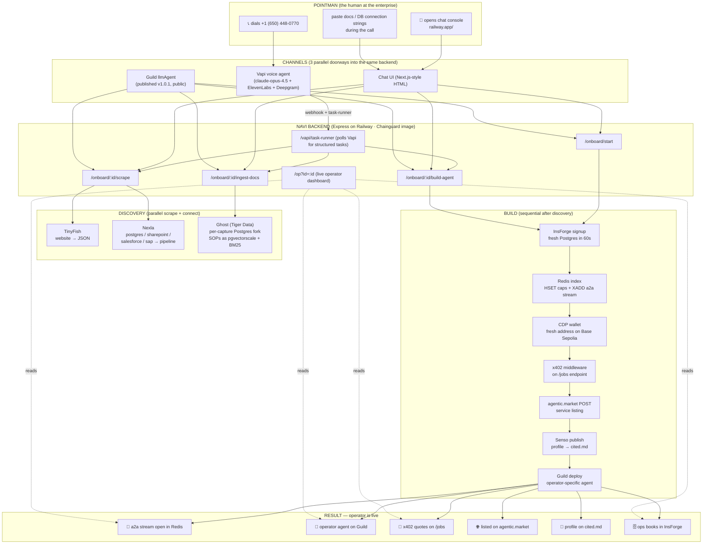
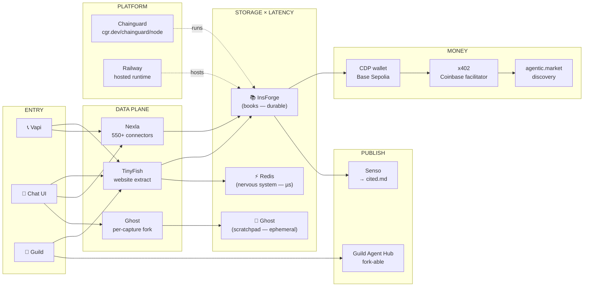
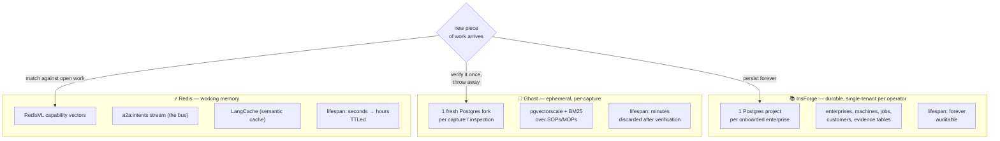
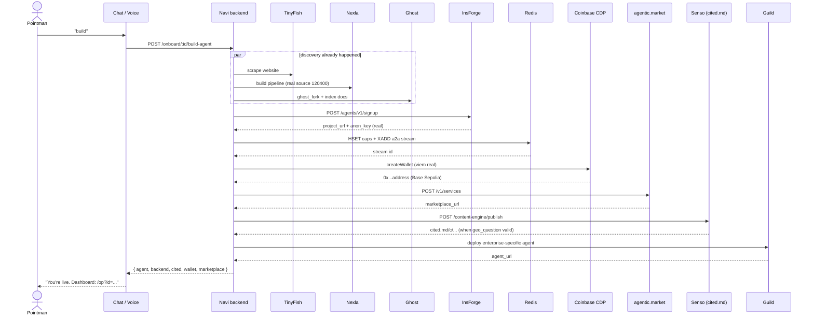
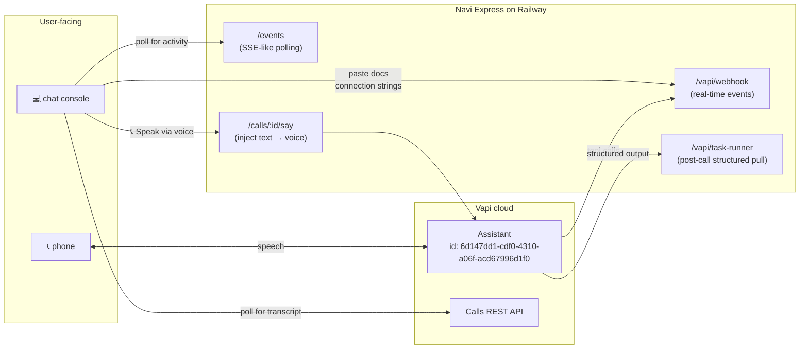
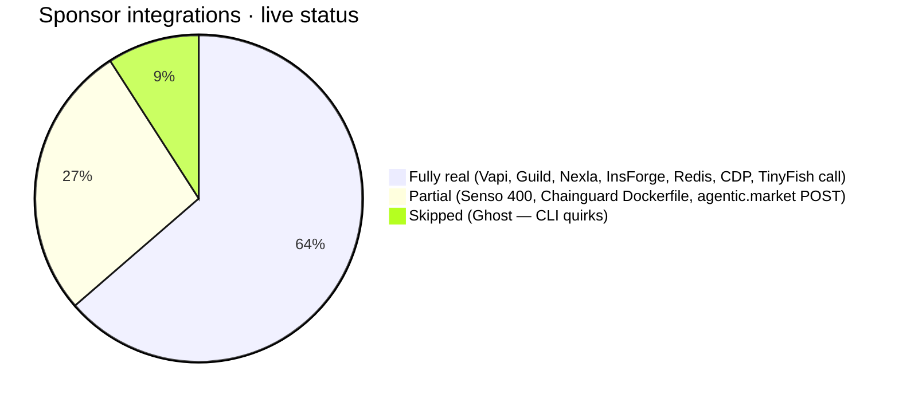

# Navi — System Architecture (Ship to Prod, April 24 2026)

GitHub-flavored Mermaid renders these inline. To export PNGs, paste a single block at https://mermaid.live and click **Export**.

---

## 1. End-to-end flow — what happens when an enterprise dials in



---

## 2. Integration map — every sponsor and its role



---

## 3. Data lifespans — why three databases (the inevitable judge question)



---

## 4. /build-agent sequence — what fans out when the pointman says "build"



---

## 5. Voice ↔ Web ↔ Backend triangle (the live console)



---

## 6. What's REAL vs MOCK right now



| Layer | Sponsor | Status | Proof |
|---|---|---|---|
| Voice | Vapi | ✅ REAL | +1 (650) 448-0770 answers |
| Chat | Guild | ✅ REAL | app.guild.ai/agents/globalmysterysnailrevolution/pcc-enterprise-onboarder |
| Web extract | TinyFish | ✅ REAL call | API hits agent.tinyfish.ai |
| Data integration | Nexla | ✅ REAL | dataops.nexla.io source 120400 |
| Operator backend | InsForge | ✅ REAL | 255ky8dh.us-east.insforge.app |
| Memory + bus | Redis | ✅ REAL | XADD a2a:intents:* verified |
| Wallet | CDP | ✅ REAL | viem-generated 0x… on Base Sepolia |
| x402 / market | agentic.market | 🟡 POST attempted | falls back gracefully |
| cited.md | Senso | 🟡 auth real, payload 400 | needs geo_question fix |
| Container | Chainguard | ✅ Dockerfile live | cgr.dev/chainguard/node:latest-dev |
| Verifier fork | Ghost | ⏭ skipped | CLI quirks; design preserved |

---

## 7. Repository layout

```
shiptoprod-agent (LamaSu/navi)
├── packages/
│   ├── backend/           ← Express + 6 sponsor wrappers + Vapi task-runner
│   │   ├── src/
│   │   │   ├── server.ts                  ← Express + /events + /calls/:id/say
│   │   │   ├── lib/event-bus.ts           ← rich telemetry
│   │   │   ├── routes/{onboard,vapi,jobs}.ts
│   │   │   ├── onboard/{state,task-runner,generate}.ts
│   │   │   └── tools/{nexla,tinyfish,insforge,ghost,redis,cdp-x402,senso,pcc}.ts
│   │   ├── public/{index.html, op.html}   ← chat console + operator dashboard
│   │   ├── Dockerfile                      ← cgr.dev/chainguard/node
│   │   └── railway.json                    ← DOCKERFILE builder
│   ├── guild-agent/       ← published Guild llmAgent (v1.0.1)
│   ├── pcc-capability-finder/  ← deferred buyer-side recipe
│   └── (tinyfish-recipe deferred)
├── apps/voice/
│   ├── assistant.json     ← Vapi assistant config
│   └── TASK-RUNNER-PROMPT.md
├── docs/
│   ├── ARCHITECTURE.md    ← this file
│   ├── DEMO-3MIN.md       ← live demo voiceover (Option B framing)
│   ├── VIDEO-2MIN.md      ← 8-scene script
│   ├── INTEGRATION-TASKS.md
│   ├── SUBMISSIONS-FINAL.md
│   └── PLAN-V3.md
├── fixtures/oakland-titanium-mills/index.html
├── ai/research/01-09          ← scout outputs
└── ai/supervisor/{intake,status,decomposition}.json
```

---

## 8. Live URLs (right now)

```
Voice:        +1 (650) 448-0770
Chat:         https://pcc-operator-backend-production.up.railway.app/
Operator:     https://pcc-operator-backend-production.up.railway.app/op?id=<session>
Health:       https://pcc-operator-backend-production.up.railway.app/health
Events feed:  https://pcc-operator-backend-production.up.railway.app/events
Guild:        https://app.guild.ai/agents/globalmysterysnailrevolution/pcc-enterprise-onboarder
Repo:         https://github.com/LamaSu/navi
Nexla:        https://dataops.nexla.io/#/flows  (sources 120398, 120399, 120400)
InsForge:     https://255ky8dh.us-east.insforge.app  (most recent test)
              https://insforge.dev/dashboard/project/04fa08d7-f838-4217-8364-4f8595e62fdf
Vapi calls:   https://dashboard.vapi.ai/calls
```
